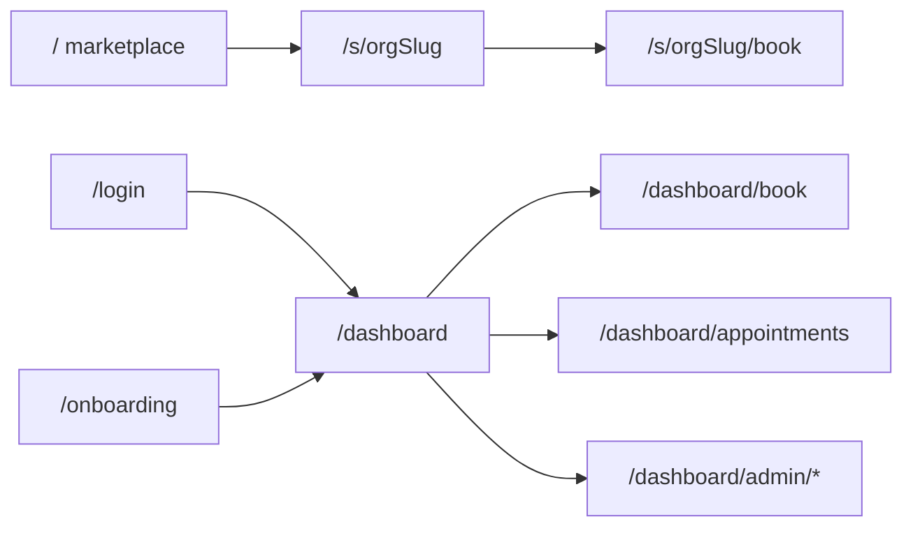

# BeautyBook Codebase Understanding

**Branch context (at discovery):** `feat/ui-polish` (ahead of origin by 7 commits). On-disk routes and `lib/` are the source of truth; prefer them over any stale index paths.

**Scope of this document:** Read-only understanding report. No functional code, schema, dependency, or env changes were made while producing it. Phase A repairs require an explicit later approval (`Approve Phase A`).

---

## 1. Executive Summary

BeautyBook3 is a **multi-tenant Manila salon marketplace + booking SaaS** built on the Next.js App Router. Customers discover published salons, pick services/staff/time slots, and book with **pay-at-salon** (no payment integration). Organization OWNER/ADMIN users manage catalog, staff schedules, locations, salon profile, and a same-day appointment board.

**Maturity: mixed / strong MVP.** Tenancy (Organization + membership + active-org context), booking with soft clash checks plus a Postgres `EXCLUDE` gist against double-booking, marketplace search (business list + date availability), GitHub Actions CI, `scripts/verify/*`, and Playwright e2e coverage all exist and are exercised in CI.

**Gaps (product and platform):** no public signup UI (`/signup` absent; Better Auth `signUpEmail` used only in seed); no customer cancel/reschedule; customer “My appointments” is **active-org only**, not a cross-salon inbox; guest public bookings can set `customerId: null`; no payments, email, or notifications; no App Router `loading.tsx` / `error.tsx`; CSP not implemented in middleware (rules ask for it); `Organization.timezone` / `Location.timezone` columns are stored but unused (runtime hardcodes `Asia/Manila`).

**Strengths:** Org-scoped queries via `requireActiveOrgContext` / `requireActiveOrgAdmin`; shared `createAppointment` with transaction clash + DB exclusion; lean dependency set; local-DB guards so seed/verify/e2e refuse non-Docker Postgres.

**Risks:** Guest bookings orphaned from customer dashboard; appointments hub does not span salons; marketplace availability walks staff×service with sequential slot queries (N+1); in-memory auth rate limit (not multi-instance safe); Cursor SaaS rules name APIs/packages that are not in the running code (`requireOrgMembership`, `rate-limiter-flexible`, `unstable_cache`).

---

## 2. Technology Stack

Versions below are from `package-lock.json` (resolved) unless noted. “Where Used” points at the primary entry, not every import.

| Area | Tool / Library | Version | Where Used | Purpose | Status / Notes |
|---|---|---:|---|---|---|
| Framework | Next.js (App Router) | 16.3.3 | `app/`, `middleware.ts` | SSR, RSC, server actions, routing | Active; agent notice in `AGENTS.md` |
| UI runtime | React / react-dom | 19.2.8 | All UI | Components | Active |
| Language | TypeScript | 5.9.3 | Whole repo (`strict`) | Types | Active |
| Styling | Tailwind CSS v4 + `@tailwindcss/postcss` | 4.3.3 | `app/globals.css`, `lib/ui.ts` | Utility CSS | Active; no component UI kit (no shadcn/MUI) |
| Fonts | Geist / Geist_Mono (next/font) | — | `app/layout.tsx` | App typography | Active |
| ORM | Prisma CLI + `@prisma/client` | 7.10.0 | `prisma/`, `lib/prisma.ts` | Schema, migrate, client | Active; client generated to `app/generated/prisma` (gitignored) |
| DB adapter | `@prisma/adapter-pg` + `pg` | 7.10.0 / 8.23.0 | `lib/prisma.ts` | Prisma 7 driver adapter over Postgres | Active; SSL relaxed for non-local |
| Database | PostgreSQL (local Docker / Supabase) | 16 in CI | `DATABASE_URL` | Persistence | Session pooler documented for Supabase |
| Auth | Better Auth + `@better-auth/prisma-adapter` | 1.7.2 | `lib/auth.ts`, `app/api/auth/[...all]/route.ts` | Email/password sessions | Active; signup API enabled, **no signup page** |
| Validation | Zod | 4.5.4 | `lib/validations/*` | Server-action input parsing | Partial; catalog admin still uses `lib/catalog.ts` `parse*` helpers |
| Dates / TZ | In-house helpers | — | `lib/timezone.ts`, `lib/format.ts`, `lib/schedule.ts` | Manila wall-clock ↔ UTC, slots | Active; **no** date-fns / luxon / dayjs |
| Env loading | dotenv | 17.4.2 | `prisma.config.ts` | Load `.env` for Prisma CLI | Active |
| HTTP rate limit | In-memory `Map` in middleware | — | `middleware.ts` | Limit `/api/auth` in production | Active; not Redis / not `rate-limiter-flexible` |
| Payments | — | — | — | — | **Not installed** |
| Email / SMS | — | — | — | — | **Not installed** |
| Charts / DnD / analytics | — | — | — | — | **Not installed** |
| Unit tests | — | — | — | — | **No** Jest/Vitest runner |
| E2E | Playwright (`@playwright/test`) | 1.62.1 | `e2e/`, `playwright.config.ts` | Browser flows | Active; Chromium project |
| Integration verify | `tsx` + `scripts/verify/*` | tsx 4.23.12 | `npm run verify` | DB-backed checks | Active; local Docker only |
| Lint | ESLint 9 + `eslint-config-next` | 9.39.5 / 16.3.3 | `npm run lint` | Lint | Active; **no** Prettier config |
| CI | GitHub Actions | — | `.github/workflows/ci.yml` | migrate, seed, lint, build, verify, e2e | Active on `main` PRs / listed branches |
| Container | Dockerfile | — | — | App image | **None** in repo (CI uses Postgres service image only) |

---

## 3. Repository Map

Top-level layout (on-disk):

| Path | Role |
|---|---|
| `app/` | Next.js App Router: pages, layouts, colocated `actions.ts`, Better Auth API route |
| `app/api/auth/[...all]/route.ts` | **Only** HTTP API route (Better Auth handler) |
| `app/generated/prisma/` | Generated Prisma client (gitignored; `postinstall` / `prisma generate`) |
| `components/` | Shared UI: `site-header`, `empty-state`, `page-header`, `booking/*` |
| `lib/` | Domain logic: booking, schedule, marketplace, catalog, appointments, auth/org gates, validations, UI class tokens |
| `prisma/schema.prisma` | Canonical schema |
| `prisma/migrations/` | 9 numbered migrations + lockfile |
| `prisma/seed.ts`, `prisma/seed-extra-orgs.ts` | Seed (creates users via `auth.api.signUpEmail`) |
| `prisma/schema-saas.prisma` | Stale / unused alternate schema (~269 lines); not wired in `prisma.config.ts` |
| `e2e/` | Playwright specs |
| `scripts/verify/` | Integration verify scripts + local DB guard |
| `docs/` | Planning / runbooks / this understanding doc |
| `.cursor/rules/` | Always-on project conventions |
| `middleware.ts` | Security headers + production `/api/auth` rate limit |
| `AGENTS.md` / `CLAUDE.md` | Next.js 16 agent guidance |
| `README.md` | Stack overview and local setup |

**Frontend vs backend:** There is no separate API server. UI and mutations live in the same Next app: Server Components for reads, server actions for writes, one catch-all auth route.

**Not present:** root `Dockerfile`, `.cursorignore`, `.cursor/BUGBOT.md`, Prettier config, `app/signup`, App Router `loading.tsx` / `error.tsx` anywhere under `app/`.

---

## 4. Cursor and Project Rules

| Artifact | Purpose | Alignment with code |
|---|---|---|
| `.cursor/rules/beautybook3.mdc` | TS strict, Server Components default, server actions, Prisma singleton, PHP `priceCents`, soft-deactivate, local verify DB guard | **Matches** current patterns (`requireUser` / `requireAdmin`, `lib/prisma`, `ActionFormState`) |
| `.cursor/rules/beautybook3-saas.mdc` | Multi-tenant isolation, Zod, Manila TZ/currency, transactions, security headers | **Partially aspirational**: documents `requireOrgMembership()`, `rate-limiter-flexible`, CSP, and `unstable_cache` — none of those exist as implemented APIs/packages in the running app |
| `AGENTS.md` / `CLAUDE.md` | “This is NOT the Next.js you know” — read Next 16 docs under `node_modules` | Meta guidance for agents |
| `.gitignore` | Ignores `.env*`, `app/generated/prisma`, `public/uploads/`, Playwright artifacts, `.next` | Matches upload and generate workflows |
| No `.cursorignore` | Full tree visible to Cursor indexing | — |

**Auth gates actually used:** `requireUser()` (`lib/require-user.ts`), `requireActiveOrgContext()` / `requireActiveOrgAdmin()` / `requireOrgMember()` (`lib/require-org.ts`), and `requireAdmin()` as an alias of `requireActiveOrgAdmin()` (`lib/require-admin.ts`). There is **no** platform superadmin path; `User.role` ADMIN is leftover from single-salon MVP and does not open `/dashboard/admin`.

---

## 5. Route Map

| Route | File(s) | Audience | Auth Required | Data Source | Primary Purpose | Current State |
|---|---|---|---|---|---|---|
| `/` | `app/page.tsx`, `app/search/*` (filters/results) | Public | No | `lib/marketplace.ts` | Search-first marketplace (orgs or date availability) | Live; `dynamic = "force-dynamic"` |
| `/search` | `app/search/page.tsx` | Public | No | — | Permanent redirect → `/` (preserves query) | Redirect |
| `/marketplace` | `app/marketplace/page.tsx` | Public | No | — | Permanent redirect → `/` (preserves query) | Redirect |
| `/s/[orgSlug]` | `app/s/[orgSlug]/page.tsx`, `layout.tsx`, `service-picker.tsx` | Public | No | `lib/salon.ts` (`getSalonStorefront`) | Salon storefront: profile, services, staff, CTA to book | Live; `notFound` if unpublished/missing |
| `/s/[orgSlug]/book` | `app/s/[orgSlug]/book/page.tsx`, `actions.ts` | Public | Optional session | Catalog + `getAvailableSlots*`, `bookPublicSlot` | Public / guest-capable booking | Live; guest → `customerId: null` |
| `/login` | `app/login/page.tsx`, `login-form.tsx` | Public | No | Better Auth client | Email/password sign-in only | Live; **no** signup UI |
| `/onboarding` | `app/onboarding/page.tsx`, `actions.ts` | Signed-in | `requireUser` | `createOrganization` | Create first org as OWNER | Live; redirects members to dashboard copy |
| `/dashboard` | `app/dashboard/page.tsx`, `layout.tsx` | Member | `requireUser` (+ org for tiles that need context) | `resolveActiveOrganization` | Hub links: services, staff, book, appointments, admin | Live |
| `/dashboard/services` | `app/dashboard/services/page.tsx` | Org member | `requireActiveOrgContext` | `listCustomerCatalog` | Read-only catalog for active org | Live |
| `/dashboard/staff` | `app/dashboard/staff/page.tsx` | Org member | Active org context | Catalog staff list | Read-only staff list | Live |
| `/dashboard/book` | `app/dashboard/book/page.tsx`, `booking-form.tsx`, `actions.ts` | Org member | `requireActiveOrgContext` | Catalog + slots; `bookSlot` | Member booking for active org | Live; always attaches `session.user.id` |
| `/dashboard/appointments` | `app/dashboard/appointments/page.tsx` | Org member | `requireActiveOrgContext` | `getCustomerAppointments(orgId, userId)` | Customer upcoming/recent for **active org only** | Live; read-only (no cancel) |
| `/dashboard/admin` | `app/dashboard/admin/page.tsx`, `layout.tsx` | OWNER/ADMIN | `requireAdmin` → `requireActiveOrgAdmin` | Org context | Admin hub | Live |
| `/dashboard/admin/categories` (+ `[id]`) | `admin/categories/*` | OWNER/ADMIN | Admin layout | Catalog mutations | Manage service categories | Live |
| `/dashboard/admin/services` (+ `[id]`) | `admin/services/*` | OWNER/ADMIN | Admin layout | Catalog mutations | Manage services | Live |
| `/dashboard/admin/staff` (+ `[id]`, `[id]/schedule`) | `admin/staff/*` | OWNER/ADMIN | Admin layout | Staff, services link, weekly schedule, time-off | Manage staff & schedule | Live |
| `/dashboard/admin/locations` (+ `[id]`) | `admin/locations/*` | OWNER/ADMIN | Admin layout | Locations | Manage branches / areas | Live |
| `/dashboard/admin/settings` | `admin/settings/*` | OWNER/ADMIN | Admin layout | Org profile, publish, cover upload | Salon settings / marketplace visibility | Live |
| `/dashboard/admin/appointments` | `admin/appointments/*` | OWNER/ADMIN | Admin layout | `getAppointmentsForDay`, status actions | Day board; set COMPLETED / NO_SHOW / CANCELLED | Live |
| `/api/auth/[...all]` | `app/api/auth/[...all]/route.ts` | Auth clients | Rate-limited in prod | Better Auth | Sign-in/session API | Live |
| (none) | — | — | — | — | Webhooks, payments, platform superadmin, dedicated STAFF workspace | **Absent** |

`OrgRole.STAFF` exists in the schema and role helpers but has **no dedicated UI workspace**; admin UI is OWNER/ADMIN only. Dashboard layout only requires a signed-in user; pages that need an org call `requireActiveOrgContext` (no membership → `/onboarding`).

---

## 6. Architecture Explanation

### Rendering model

- Default is **React Server Components**. Client boundaries are sparse (~11 `"use client"` modules): login form, booking form, service picker, org/location switchers, admin `ActionForm`, search filters, appointment status buttons, etc.
- Root layout (`app/layout.tsx`) sets Geist fonts, light theme (`bg-white text-zinc-900`), and global CSS.

### Mutations

- Prefer **colocated server actions** (`actions.ts`) over REST.
- Success path: mutate → `revalidatePath(...)` → `redirect(...)`.
- Admin forms often use `ActionForm` + `ActionFormState` (`lib/action-form-state.ts`) for inline validation errors.
- Booking slot submit uses form actions that return `ActionFormState` on error and redirect on success (`bookSlot`, `bookPublicSlot`).

### Authorization

- **Not** enforced by middleware route guards. Middleware only applies security headers and (in production) in-memory rate limiting for `/api/auth`.
- Page/layout gates: `requireUser`, `requireActiveOrgContext`, `requireActiveOrgAdmin`.
- Active organization/location resolution lives in `lib/org-context.ts` (cookie/session-backed active org among memberships).

### Data access

- Single Prisma client: `lib/prisma.ts` (`Pool` + `@prisma/adapter-pg`).
- Domain queries live in `lib/` (`booking`, `schedule`, `marketplace`, `catalog`, `appointments`, `salon`, `tenant`, `locations`).
- Org-scoped admin/member queries take `organizationId` from the resolved active org, not from untrusted client IDs alone (locations/staff still re-checked against `organizationId` in actions).

### Caching

- Marketplace home is `force-dynamic`.
- No `unstable_cache` usage in application code (despite SaaS rule examples).
- Cache invalidation is path-based via `revalidatePath`.

### Environment (names only)

| Variable | Role |
|---|---|
| `DATABASE_URL` | Postgres connection (required) |
| `BETTER_AUTH_SECRET` | Auth secret |
| `BETTER_AUTH_URL` | Auth base URL |
| `DISABLE_AUTH_RATE_LIMIT` | Optional; `"1"` skips rate limit even in production |
| `PLAYWRIGHT_BASE_URL` | Optional e2e base URL |

### Cross-cutting gaps

- No `app/error.tsx` or `loading.tsx` (only `app/not-found.tsx`).
- Middleware sets `X-Frame-Options`, `X-Content-Type-Options`, `Referrer-Policy`, `Permissions-Policy` — **not** Content-Security-Policy.
- Uploads for covers/photos write under `public/uploads/` with magic-byte checks and 2MB cap (`lib/org-cover.ts`).

---

## 7. Database and Domain Model

### Entities (from `prisma/schema.prisma`)

| Entity | Key fields / relations | Notes |
|---|---|---|
| `User` | email unique, `Role` (CUSTOMER/STAFF/ADMIN), phone | Better Auth user; `Role` mostly legacy for org admin |
| `Session` / `Account` / `Verification` | Auth tables | Mapped to Better Auth |
| `Organization` | slug unique, timezone/currency defaults, `published`, cover, description, phone | Marketplace visibility via `published` |
| `OrganizationMember` | org + user unique, `OrgRole` | OWNER / ADMIN / STAFF / MEMBER |
| `Location` | org-scoped, area, timezone, one default per org (partial unique) | Soft `active` |
| `ServiceCategory` | org + slug unique | Soft structure for catalog |
| `Service` | durationMin, priceCents (centavos), category, soft `active` | |
| `Staff` | location-bound, optional `userId`, photo, soft `active` | `userId` unused for login linking in UI |
| `StaffService` | M2M staff ↔ service | Capability matrix for booking |
| `StaffSchedule` | weekday + start/end time strings | Weekly template |
| `TimeOff` | startsAt/endsAt | Blocks slots |
| `Appointment` | staff, optional customer, startsAt/endsAt, status | Default status in schema `PENDING`; create path sets `CONFIRMED` |
| `AppointmentService` | snapshot duration/price per service | Unique (appointmentId, serviceId) |

**Enums:** `Role`, `OrgRole`, `AppointmentStatus` (PENDING, CONFIRMED, COMPLETED, CANCELLED, NO_SHOW), `Weekday`.

**Integrity:** Migration `20260830034500_appointment_staff_no_overlap` adds Postgres `EXCLUDE` gist so non-cancelled appointments for the same staff cannot overlap (`Appointment_staff_no_overlap`). Application code also does a transaction-time clash query and maps exclusion errors to a user-facing “no longer available” message.

**Absent models:** Payment, Notification, Review, PlatformAdmin, Invitation.

### Booking-related data flow

1. **Search / discover** — `listMarketplaceOrganizations` / `listMarketplaceServices` / `searchMarketplaceAvailability` filter `organization.published: true` and active catalog/locations (`lib/marketplace.ts`).
2. **View salon** — `getSalonStorefront(orgSlug)` loads published org profile, locations, categories/services, staff (`lib/salon.ts`).
3. **Services** — Multi-select up to `MAX_BOOKING_SERVICES` (6) with combined duration ≤ `MAX_COMBINED_DURATION_MIN` (240) (`lib/booking-limits.ts`).
4. **Staff** — Filtered to active staff at selected location who offer **all** selected services (`staffOffersAllServices`).
5. **Availability** — `getAvailableSlots` / `getAvailableSlotsForDay`: weekly schedule minus overlapping non-cancelled appointments minus time-off; 30-minute grid; future-only (`lib/booking.ts` + `lib/schedule.ts`). Wall clock uses hardcoded `SALON_TIMEZONE = "Asia/Manila"` (`lib/timezone.ts`), **not** `Organization.timezone` / `Location.timezone`.
6. **Create booking** — `createAppointment`: validate services/staff/location/grid/schedule/time-off → transaction clash check → insert `CONFIRMED` + `AppointmentService` snapshots → DB EXCLUDE as last line of defense.
7. **Manage booking** — Customers: list only (`getCustomerAppointments`). Admins: `updateAppointmentStatus` to COMPLETED / NO_SHOW / CANCELLED for appointments still PENDING or CONFIRMED.

---

## 8. Booking Flow Trace

### Step 1 — Entry points

| | |
|---|---|
| **Files** | `app/page.tsx` (marketplace), `app/s/[orgSlug]/page.tsx` (storefront CTA / service picker), `app/dashboard/book/page.tsx` (member hub) |
| **What works** | Public discovery and storefront; members can book inside active org |
| **Missing** | Cross-salon “continue booking” from a global customer inbox |
| **Risk level** | Low |

### Step 2 — Choose location

| | |
|---|---|
| **Files** | `BookingForm`, public/dashboard book pages; location switcher on dashboard |
| **What works** | Active locations; staff filtered to location; public path validates location belongs to published org |
| **Missing** | — |
| **Risk level** | Low |

### Step 3 — Choose service(s)

| | |
|---|---|
| **Files** | `app/s/[orgSlug]/service-picker.tsx`, `components`/booking helpers, `lib/booking-limits.ts`, `lib/validations/booking.ts` |
| **What works** | Multi-service select with max 6 / 240 minutes; sticky mobile CTA on picker |
| **Missing** | — |
| **Risk level** | Low |

### Step 4 — Choose staff

| | |
|---|---|
| **Files** | Book pages; `staffOffersAllServices` |
| **What works** | Only staff who can perform the full combination at that location |
| **Missing** | “Any available staff” auto-assign |
| **Risk level** | Low (product gap, not a correctness bug) |

### Step 5 — Choose time slot

| | |
|---|---|
| **Files** | `lib/booking.ts` (`getAvailableSlots*`), `lib/schedule.ts`, `BookingForm` |
| **What works** | Schedule − appointments − time-off; 30-min grid; past slots excluded |
| **Missing** | Per-org/location timezone fields ignored |
| **Risk level** | Medium if non-Manila orgs are introduced without code changes |

### Step 6 — Validate and submit

| | |
|---|---|
| **Files** | `lib/validations/booking.ts` (Zod), `app/dashboard/book/actions.ts` (`bookSlot`), `app/s/[orgSlug]/book/actions.ts` (`bookPublicSlot`), `lib/booking.ts` (`createAppointment`) |
| **What works** | Zod parse; org/location/staff/service checks; transaction clash; EXCLUDE mapping |
| **Missing** | Public path allows `customerId: session?.user?.id ?? null` |
| **Risk level** | High for guest orphaning (see I03) |

### Step 7 — Confirmation / payment messaging

| | |
|---|---|
| **Files** | Redirects to `?booked=1` on public book or `/dashboard/appointments?booked=1`; copy in UI + `lib/appointment-status.ts` |
| **What works** | Explicit “Pay at the salon” messaging; no payment capture |
| **Missing** | Receipt email, calendar invite, deposit |
| **Risk level** | Low (by design for MVP) |

### Step 8 — Customer cancel / reschedule

| | |
|---|---|
| **Files** | `lib/appointments.ts` (`updateAppointmentStatus` is admin-settable only); `app/dashboard/appointments/page.tsx` (display only) |
| **What works** | Admin can mark CANCELLED / COMPLETED / NO_SHOW |
| **Missing** | Customer-initiated cancel or reschedule |
| **Risk level** | High (product / support burden) |

### Step 9 — Authorization boundaries

| | |
|---|---|
| **Files** | Dashboard book: `requireActiveOrgContext`; public book: `getPublishedOrganizationBySlug`; admin day board: `requireActiveOrgAdmin` |
| **What works** | Members cannot hit admin without OWNER/ADMIN; unpublished salons 404 on public routes |
| **Missing** | Guest identity binding; cross-org customer history authorization model |
| **Risk level** | Medium–High depending on guest policy |

### Step 10 — Timezone handling

| | |
|---|---|
| **Files** | `lib/timezone.ts` (`SALON_TIMEZONE = "Asia/Manila"`); schema defaults on Organization/Location |
| **What works** | Consistent Manila wall-clock for current single-market MVP |
| **Missing** | Reading/writing stored timezone columns |
| **Risk level** | Medium for multi-region expansion; Low while Manila-only |

### Step 11 — Double-booking defenses

| | |
|---|---|
| **Files** | Soft filter in `collectAvailableSlots`; clash `findFirst` in `createAppointment` transaction; Postgres `Appointment_staff_no_overlap` EXCLUDE |
| **What works** | Layered defense; exclusion errors mapped to friendly message |
| **Missing** | — (solid for same-staff overlaps) |
| **Risk level** | Low |

---

## 9. UI/System Review

**Current visual system (as shipped):**

- Light zinc palette with shared tokens in `lib/ui.ts` (`pageMainClass`, `primaryButtonClass`, `surfaceClass`, alerts, etc.).
- Marketplace/storefront accents lean emerald/stone in places (e.g. pay copy, placeholders).
- Geist Sans / Geist Mono via `next/font`.

**Marketplace / storefront:**

- Home is a **text-centered discovery** composition (filters + results), not a full-bleed marketing hero image.
- Salon cards (`components/booking/BusinessCard.tsx`) and storefront/admin staff/cover previews use raw `` — **no** `next/image` usage in app UI.
- Emerald-style placeholders when cover missing.
- Service picker: sticky mobile CTA; chip-style navigation patterns on search filters (`SearchFilters`).

**Empty / error / loading:**

- Shared `EmptyState` used on catalog/appointments/book empty paths.
- `app/not-found.tsx` exists.
- No route-level `loading.tsx` or `error.tsx` → navigation and render failures fall to Next defaults.

**Admin UI consistency:**

- Some admin pages use `pageMainClass`; many use duplicated `mx-auto w-full max-w-5xl flex-1 px-4 py-10` padding (categories, services, staff, locations, appointments, settings) — layout drift vs dashboard member pages.

**Uploads:**

- Cover/staff images: filesystem under `public/uploads/`, magic-byte sniffing (JPEG/PNG/WebP), 2MB limit (`lib/org-cover.ts`). Seeded demo images live under `public/images/salons`.

**Accessibility / motion:**

- Focus ring utilities exist in `lib/ui.ts` (`focusRingClass`).
- No dedicated motion system beyond ordinary CSS/Tailwind; no animation library.

---

## 10. Tooling and Test Coverage

### NPM scripts (`package.json`)

| Script | Purpose |
|---|---|
| `dev` / `build` / `start` | Next.js lifecycle |
| `lint` | ESLint |
| `postinstall` / `prisma:generate` | Generate client |
| `prisma:migrate` | `migrate deploy` |
| `prisma:migrate:dev` | `migrate dev` |
| `prisma:studio` / `prisma:seed` | Studio / seed |
| `verify` (+ granular `verify:*`) | Integration suite against local Docker Postgres only |
| `test:e2e` / `test:e2e:ui` | Playwright |

### Safe diagnostics already run (this understanding pass)

| Command | Result |
|---|---|
| `npm run lint` | **Passed** with 2 warnings: unused `_fallbackFirstId` in `lib/validations/booking.ts`; unused `DEMO_ACCOUNT` in `prisma/seed-extra-orgs.ts` |
| `npx tsc --noEmit` | **Passed** |
| `npm run build` | **Not run** (writes `.next`) |
| `npm run verify` | **Not run** (mutates/reads local DB) |
| `npm run test:e2e` | **Not run** |

### CI (`.github/workflows/ci.yml`)

On push/PR (configured branches): Postgres 16 service on host port **5433**, `migrate deploy`, seed, lint, **build**, **verify**, then Playwright e2e. Env names: `DATABASE_URL`, `BETTER_AUTH_SECRET`, `BETTER_AUTH_URL`.

### Automated coverage present

| Area | Evidence |
|---|---|
| Booking / pay-at-salon copy | `e2e/booking.spec.ts`, `scripts/verify/booking.ts`, `slots.ts` |
| Marketplace search / availability | `e2e/search.spec.ts`, `search-availability.spec.ts`, `scripts/verify/marketplace-*.ts` |
| Storefront + public book | `e2e/salon-storefront.spec.ts` |
| Locations | `e2e/locations.spec.ts`, `location-booking.spec.ts` |
| Admin appointments | `e2e/admin-appointments.spec.ts`, `scripts/verify/appointments.ts` |
| Tenancy isolation | `e2e/isolation.spec.ts`, `scripts/verify/org-scope.ts` |
| Auth / onboarding / catalog | `e2e/auth.spec.ts`, `onboarding.spec.ts`, `catalog.spec.ts` |

### Coverage gaps

- Public self-registration UI (none to test).
- Customer cancel / reschedule.
- Guest booking → later claim / login linkage.
- Payments / notifications (not in product).
- Cross-salon customer appointment inbox.
- Unit/component test runner (none).

### Local DB safety

`lib/test-only-local-db.ts` / verify guard: seed, verify, and Playwright refuse databases that are not local Docker Postgres (`localhost`/`127.0.0.1`, port `5433`, database `beautybook`). There is no `VERIFY_ALLOW_REMOTE` bypass (per project rules).

---

## 11. Issues Found

Evidence-based only. Suggested directions are non-binding until Phase approval.

| ID | Severity | Area | File(s) | Issue | User/Business Impact | Evidence | Suggested Direction |
|---|---|---|---|---|---|---|---|
| I01 | High | Product / auth | `app/login/*` (no `app/signup`); `prisma/seed.ts`, `prisma/seed-extra-orgs.ts`; `lib/auth.ts` | No customer self-registration UI; Better Auth email/password signup is enabled but only seeds call `signUpEmail` | Real customers cannot create accounts without manual/seed intervention | Grep: `signUpEmail` only under `prisma/seed*.ts`; no `/signup` route | Add `/signup` (or invite flow) aligned with Better Auth; e2e for register→book |
| I02 | High | Booking UX | `lib/appointments.ts`; `app/dashboard/appointments/page.tsx` | Customers cannot cancel or reschedule; status updates are admin-only (`COMPLETED` / `NO_SHOW` / `CANCELLED`) | Support load; no-shows; poor trust | `updateAppointmentStatus` + admin UI only; appointments page is read-only | Customer cancel (policy windows); optional reschedule reusing `createAppointment` constraints |
| I03 | High | Bookings / identity | `app/s/[orgSlug]/book/actions.ts` (~L55) | Guest bookings store `customerId: null` | Booking invisible in customer dashboard; salon sees appointment without linked user | `customerId: session?.user?.id ?? null` | Product decision: force login, or collect contact + claim flow |
| I04 | High | Product | `lib/appointments.ts` (`getCustomerAppointments`); `app/dashboard/appointments/page.tsx` | “My appointments” scoped to **active organization**, not all salons the user booked | Marketplace customers miss bookings at other orgs when switched | `where: { organizationId, customerId, ... }` | Cross-org inbox **or** explicit UX that hub is per-salon |
| I05 | Medium | Correctness | `lib/timezone.ts`; `prisma/schema.prisma` (`Organization.timezone`, `Location.timezone`) | Stored timezone columns unused; runtime hardcodes Asia/Manila | Wrong local days/hours if non-Manila data appears | `SALON_TIMEZONE = "Asia/Manila"` vs schema defaults | Use org/location TZ or document Manila-only and stop implying per-row TZ |
| I06 | Medium | UX / reliability | `app/` (glob: no `loading.tsx` / `error.tsx`) | No route-level loading or error boundaries | Blank/harsh failures on slow queries or thrown errors | No matching files under `app/` | Add `error.tsx` / `loading.tsx` at app and key segments |
| I07 | Medium | Security docs vs code | `middleware.ts`; `.cursor/rules/beautybook3-saas.mdc` | Rules require CSP; middleware does not set CSP | Policy drift; XSS mitigation weaker than documented | Headers in middleware lack CSP; SaaS rule lists CSP | Decide CSP policy and implement, or update rules |
| I08 | Medium | Scale / perf | `lib/marketplace.ts` (`searchMarketplaceAvailability`) | Nested loops call `getAvailableSlotsForDay` per staff×service | Slow marketplace date search as catalog grows | L341–350 loop awaits slots per link | Batch slot computation or constrain fan-out |
| I09 | Medium | Ops | `middleware.ts` (L9–34, L50–62) | Auth rate limit is process-local `Map` | Ineffective or uneven across multiple Node instances | In-memory `authBuckets` | Shared store / edge rate limit if multi-instance |
| I10 | Low | Consistency | `lib/booking.ts` (~L251); schema `Appointment.status @default(PENDING)` | Creates always `CONFIRMED`; `PENDING` unused in happy path | Confusing domain semantics / future workflow | Explicit `AppointmentStatus.CONFIRMED` on create | Either use PENDING for approval flows or change default + docs |
| I11 | Low | Lint | `lib/validations/booking.ts`; `prisma/seed-extra-orgs.ts` | Two unused-variable lint warnings | Noise in CI/lint signal | Lint diagnostic output | Remove or use the bindings |
| I12 | Low | Images | `components/booking/BusinessCard.tsx`, storefront/admin `` usages | No `next/image`; remote/owner URLs via `` | Missed optimization / sizing discipline | Grep: `<img` present; no `next/image` imports in app UI | Adopt `next/image` where domains allow |
| I13 | Low | Maintainability | `.cursor/rules/beautybook3-saas.mdc` vs `lib/require-org.ts`, `middleware.ts`, `package.json` | Rules name `requireOrgMembership`, `rate-limiter-flexible`, `unstable_cache` not present in code | Agents/humans follow non-existent APIs | SaaS rule snippets vs repo grep | Sync rules to real helpers (`requireOrgMember` / active-org gates) |

---

## 12. Recommended Repair Plan

**Do not implement until explicitly approved.** After this document, work stops pending `Approve Phase A`. Each phase lists issue IDs; detailed patches come only after approval.

### Phase A — Critical safety / production blockers

| Item | Issue IDs | Files (expected) | Expected change | DB impact | Risk | Test method | Approval required |
|---|---|---|---|---|---|---|---|
| A1. Confirm hosted secrets/env | — | Ops / `.env` (no commit) | Verify `DATABASE_URL`, `BETTER_AUTH_*` on hosted; no secrets in git | None | Low | Manual checklist | Yes (ops) |
| A2. Security header / CSP alignment | I07 | `middleware.ts`, possibly `next.config.*`, SaaS rule | Implement agreed CSP **or** document deferral and update rules | None | Medium (header breakage) | Manual header check; smoke browse | Yes |
| A3. Guest booking policy | I03 (drives I01/I04) | `app/s/[orgSlug]/book/actions.ts`, possibly book UI | Force login before book **or** keep guests + define claim/contact rules | Possibly nullable `customerId` policy / future fields | High (product) | e2e public book ± auth | Yes (product) |

Phase A is intentionally thin on code until product answers in §13 are settled.

### Phase B — Booking correctness and authorization

| Item | Issue IDs | Files (expected) | Expected change | DB impact | Risk | Test method | Approval required |
|---|---|---|---|---|---|---|---|
| B1. Customer cancel (± reschedule) | I02 | `lib/appointments.ts`, dashboard appointments UI/actions | Customer-safe status transitions with rules | Likely none (status only) | Medium | verify + e2e | Yes |
| B2. Appointments hub scope | I04 | `lib/appointments.ts`, `app/dashboard/appointments/page.tsx`, nav copy | Cross-org inbox **or** explicit per-salon UX | Query shape only (unless new indexes) | Medium | e2e multi-org | Yes |
| B3. Signup / login product path | I01 | `app/signup` (new), auth client, header links | Public registration | User/Account rows via Better Auth | Medium | e2e auth | Yes |
| B4. Timezone field usage | I05 | `lib/timezone.ts`, callers, possibly admin location forms | Honor stored TZ or lock Manila-only in docs/UI | None if code-only | Medium | verify slots | Yes |

### Phase C — UI / mobile / a11y / perf

| Item | Issue IDs | Files (expected) | Expected change | DB impact | Risk | Test method | Approval required |
|---|---|---|---|---|---|---|---|
| C1. Loading / error UI | I06 | `app/error.tsx`, `loading.tsx`, segment-level as needed | Friendly pending/error states | None | Low | Manual + e2e smoke | Yes |
| C2. Marketplace availability efficiency | I08 | `lib/marketplace.ts`, possibly `lib/booking.ts` | Reduce N+1 slot fan-out | None | Medium | verify marketplace + timing | Yes |
| C3. Images | I12 | BusinessCard, storefront, admin previews | `next/image` where safe | None | Low | Visual smoke | Yes |
| C4. Admin layout token reuse | — (consistency) | `app/dashboard/admin/**/page.tsx` | Prefer `pageMainClass` / shared layout | None | Low | Visual | Optional |

### Phase D — Refactor / tests / docs

| Item | Issue IDs | Files (expected) | Expected change | DB impact | Risk | Test method | Approval required |
|---|---|---|---|---|---|---|---|
| D1. Finish Zod for catalog admin | — | `lib/catalog.ts`, admin `actions.ts`, `lib/validations/*` | Replace remaining `parse*` helpers | None | Low | Admin e2e / verify | Yes |
| D2. Sync Cursor rules | I13 | `.cursor/rules/beautybook3-saas.mdc` | Match real gates, rate limit, caching | None | Low | Doc review | Yes |
| D3. Lint cleanups | I11 | Named unused bindings | Remove/use variables | None | Low | `npm run lint` | Optional |
| D4. Expand e2e | I01–I04 after fixes | `e2e/*` | Signup, cancel, guest policy, cross-org | None | Low | `test:e2e` | Yes |
| D5. PENDING vs CONFIRMED semantics | I10 | `lib/booking.ts`, schema/docs | Align default and create status | Migration only if default changes | Low–Medium | verify booking | Yes |

---

## 13. Questions for Me

Blocking questions before safe Phase A / B product work:

1. **Guest booking:** Should anonymous public booking stay allowed, or must customers sign in before a slot is created?
2. **Appointments hub:** Should “My appointments” become a **cross-salon** customer inbox, or stay **active-org only** with clearer UX?
3. **Signup:** Is public email/password **signup** in-scope for Phase A/B, or should accounts stay invite/seed-only for now?
4. **CSP:** Do you want Content-Security-Policy implemented in Phase A (strict vs report-only), or defer with a rules-doc update only?
5. **Timezone:** Confirm Manila-only for the next release (ignore DB TZ columns), or should org/location timezone fields become authoritative?
