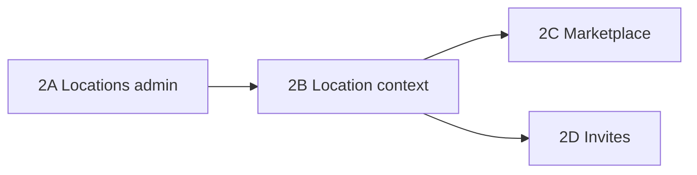

# Phase 2 Plan — Multi-location & marketplace depth

**Status:** 2A + 2B merged — **2C in PR #6**  
**Base:** `main` @ PR #4 + #5 merged (`ae12f9b`)  
**Hosted DB:** migrations A/B/C applied, smoke-tested via `npm run dev` + browser

---

## Goal

Let a single organization operate **multiple salon locations** and improve **public discovery/booking UX**, without changing auth stack or adding billing.

## Out of scope (Phase 2)

- Stripe / subscriptions (Phase 4)
- RLS policies on Supabase (Phase 5 — document only until PostgREST exposure)
- Geo search / maps (defer until `Location.address` is richer)
- Custom domains per org

---

## Current gaps (from codebase)

| Area | Today | Phase 2 target |
|------|-------|----------------|
| Locations | Schema supports many; UI assumes **one default** | Admin CRUD + active location cookie |
| Booking | `locationId` required; dashboard uses `active.location` from default only | User picks location when org has >1 |
| Marketplace | Lists published orgs, links to `/s/[slug]/book` | Category filter; optional location line in card |
| `components/booking/*` | Stub cards from origin; unused | Wire into marketplace or delete |
| Team | `OrganizationMember` + roles exist | Invite flow (email link or code) |

---

## Proposed work packages

### 2A — Location management (foundation) — **do first**

**Why first:** booking, staff, and schedules already store `locationId`; without admin UI every new location needs SQL.

| Task | Details |
|------|---------|
| `lib/locations.ts` | `listLocations(orgId)`, `createLocation`, `updateLocation`, `setDefaultLocation`, soft-deactivate |
| Admin routes | `/dashboard/admin/locations`, `/dashboard/admin/locations/[id]` |
| Validation | `lib/validations/location.ts` (name, address, timezone, active) |
| Nav | Add "Locations" to `admin-nav.tsx` |
| Seed | Optional second location on demo org for E2E |

**Schema:** No migration — `Location` model already has `name`, `address`, `timezone`, `isDefault`, `active`.

**Acceptance:**
- Admin can add/edit/deactivate locations
- Exactly one `isDefault` per org (transaction or constraint logic in lib)
- `npm run verify` + new E2E: admin creates location, appears in list

---

### 2B — Active location context (dashboard + booking)

**Why:** Staff and appointments are location-scoped; dashboard must know which branch is active.

| Task | Details |
|------|---------|
| Cookie | `activeLocationId` (mirror `activeOrganizationId` pattern in `lib/org-context.ts`) |
| `resolveActiveOrganization` | Return all active locations; pick cookie → default → first |
| `LocationSwitcher` | Client component in `dashboard-nav` (only when `locations.length > 1`) |
| Booking form | Location `<select>` step when multiple locations; pass `locationId` to `createAppointment` |
| Public book | `/s/[orgSlug]/book` — location picker if org has multiple published locations |
| Staff admin | New staff assigned to selected/default location; schedule stays per staff |

**Acceptance:**
- Book at location A does not show staff/slots from location B
- Switching location updates book page and admin appointments filter

---

### 2C — Marketplace polish

**Why:** Phase 1 marketplace is minimal; stubs exist but unused.

| Task | Details |
|------|---------|
| Marketplace page | Use `listPublishedOrganizations` + service category counts |
| Category filter | Query param `?category=hair` (slug); filter orgs with active services in category |
| `BusinessCard` / `ServiceCard` | Integrate stubs or replace with Tailwind cards matching app style |
| Org public page | `/s/[orgSlug]` show locations list if >1 |

**Defer:** area/geo filters until addresses are normalized.

**Acceptance:**
- E2E: marketplace filter by category shows demo salon when it has matching services
- Manual: cards show PHP prices via `formatPrice`

---

### 2D — Org invites (team growth)

**Why:** Onboarding creates org for owner; no way to add staff/admin yet.

| Task | Details |
|------|---------|
| `OrganizationInvite` model | `id`, `organizationId`, `email`, `role`, `token`, `expiresAt`, `acceptedAt` |
| Migration | New table + index on `token` |
| `/invite/[token]` | Accept flow: sign in or sign up → create `OrganizationMember` |
| Admin UI | `/dashboard/admin/team` — send invite, list pending, revoke |
| Email | **Defer real email** — show invite link in UI for dev; hook for Resend later |

**Acceptance:**
- Owner generates invite link; second user joins as STAFF
- Invited user cannot access admin routes above their role

---

## Suggested PR order

| PR | Scope | Est. | Status |
|----|-------|------|--------|
| PR-4 | 2A Location CRUD | 1–2 days | **Merged** |
| PR-5 | 2B Location switcher + booking | 2–3 days | **Merged** |
| PR-6 | 2C Marketplace filters + cards | 1–2 days | **In PR** |
| PR-7 | 2D Invites (optional in Phase 2) | 2–3 days | Deferred |

**Recommendation:** Ship **2A + 2B** as minimum viable Phase 2; **2C** if time; **2D** can slip to Phase 2.5.

---

## Testing plan (each PR)

- `npm run verify` (local Postgres)
- `npm run test:e2e` — extend with location + marketplace cases
- Smoke on hosted Supabase before merge (`VERIFY_ALLOW_REMOTE=1`)

---

## Docs updates (ongoing)

- [x] `docs/supabase-migration-runbook.md` — ownership fix + B/C applied
- [ ] Mark Phase 3 complete in `docs/saas-next-steps.md` after this session
- [ ] Check off Phase 2 items as PRs land

---

## Approval checklist

- [x] Agree on PR order (2A → 2B → 2C → 2D)
- [x] Agree 2D invites can slip to Phase 2.5
- [x] Agree no schema change for 2A/2B (location table exists)
- [x] PR-4: Location admin CRUD — merged
- [x] PR-5: Location switcher + booking — merged
- [ ] PR-6: Marketplace filters + cards
